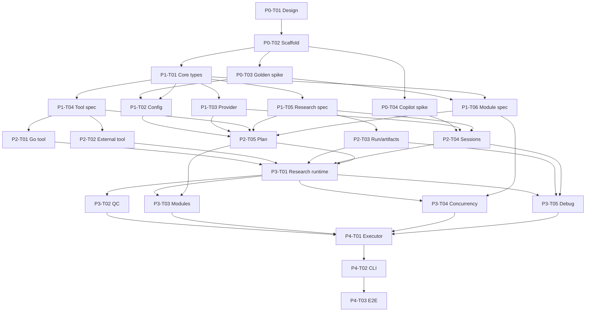

# r42 Implementation Tasks

This is the execution progress table derived from
[`docs/design.md`](docs/design.md). Each task is intended to be one independently
reviewable PR. Agents must follow `AGENTS.md`, including TDD for Go changes, the
required local checks, CI coverage self-check, and independent code review.

## Status

| Status | Meaning |
| --- | --- |
| `DONE` | Acceptance criteria are satisfied in the current branch. |
| `READY` | All dependencies are done; an agent may claim the task. |
| `BLOCKED` | One or more listed dependencies are not done. |
| `IN PROGRESS` | One agent owns the task and its declared paths. |

A single coordinator owns status and owner updates in this file. Workers request
a claim from the coordinator and do not include progress-table edits in their
implementation PRs. This avoids every parallel branch conflicting on `tasks.md`.
Do not claim two tasks in one PR. A task becomes `DONE` only after its tests,
checks, and review requirements are satisfied.

## Global Definition of Done

Every Go task must provide:

1. A failing test first and recorded Red evidence.
2. The smallest implementation that makes the test pass.
3. `go vet ./...`, `go test ./... -count=1`, and `golangci-lint run` passing.
4. CI coverage self-check required by `AGENTS.md`.
5. Independent code-review verdict required by `AGENTS.md`.
6. Documentation updates when public behavior changes.

Pure documentation tasks are exempt from TDD but must check Markdown links and
cross-document consistency.

## Dependency Graph

Tasks sharing a dependency may run in parallel only when their owned paths do
not overlap. Integration tasks own wiring files; leaf tasks must not pre-emptively
edit those files.

## Progress Table

| ID | Status | Owner | Task | Depends on | Primary owned paths |
| --- | --- | --- | --- | --- | --- |
| P0-T01 | DONE | Codex | Record accepted design and distributed task plan | - | `docs/design.md`, `tasks.md` |
| P0-T02 | DONE | Codex | Scaffold Go module, project layout, base lint/test config, and CI | P0-T01 | `go.mod`, `go.sum`, `.golangci.yml`, `.github/workflows/**`, empty package roots |
| P0-T03 | DONE | Codex | Golden capability spike: decode, references, Plan/Apply, nested executor, variable loading | P0-T02 | `internal/goldenprobe/**`, `docs/spikes/golden.md` |
| P0-T04 | DONE | Codex | Official Copilot SDK capability spike: session fields, tools, skills, filters, permission, close | P0-T02 | `internal/copilotprobe/**`, `docs/spikes/copilot.md` |
| P1-T01 | DONE | Codex | Core domain types, Issue/ToolResponse invariants, cty type utilities | P0-T02 | `internal/spec/**` |
| P1-T02 | DONE | Codex | Source loader, HCL functions (`env`, `tool_name`), diagnostics, address model | P0-T02, P0-T03, P1-T01 | `internal/config/**` |
| P1-T03 | DONE | Codex | `model_provider` schema, auth one-of, retry merge and classifier | P1-T01 | `internal/provider/**` |
| P1-T04 | READY | - | `go_tool` and `external_tool` schemas plus cty/JSON schema derivation | P1-T01 | `internal/tool/spec/**` |
| P1-T05 | READY | - | `research`, nested `qc`, artifact, and session-policy schemas | P1-T01 | `internal/research/spec/**` |
| P1-T06 | READY | - | Terraform-like variable/module/output schemas, source resolution, cycle detection | P0-T03, P1-T01 | `internal/module/spec/**` |
| P2-T01 | BLOCKED | - | Inline Go AST/type validator, wrapper generator, compiler cache, temp cleanup | P1-T04 | `internal/tool/gotool/**` |
| P2-T02 | BLOCKED | - | External tool JSON protocol, limits, stderr policy, process-tree cancellation | P1-T04 | `internal/tool/external/**` |
| P2-T03 | BLOCKED | - | Run/workspace manager, artifact paths and recursive validation | P1-T05 | `internal/run/**`, `internal/artifact/**` |
| P2-T04 | BLOCKED | - | Provider runtime and official Copilot SDK session factory with lifecycle retries | P0-T04, P1-T03, P1-T05 | `internal/copilot/**` |
| P2-T05 | BLOCKED | - | Immutable plan model, nested-plan persistence, sensitive redaction/permissions | P1-T02, P1-T03, P1-T04, P1-T05, P1-T06 | `internal/plan/**` |
| P3-T01 | BLOCKED | - | Research completion state machine and terminal-tool protocol | P2-T01, P2-T02, P2-T03, P2-T04, P2-T05 | `internal/research/runtime/**` |
| P3-T02 | BLOCKED | - | Persistent QC state machine, verdict tool, criteria, revision loop | P3-T01 | `internal/qc/**` |
| P3-T03 | BLOCKED | - | Module nested executor, atomic outputs, timeout propagation | P2-T05, P3-T01 | `internal/module/runtime/**` |
| P3-T04 | BLOCKED | - | Hierarchical global/module research semaphore and permit lifecycle | P3-T01, P1-T06 | `internal/concurrency/**` |
| P3-T05 | BLOCKED | - | Debug event files, prompt/transcript capture, normal-mode redaction | P2-T03, P2-T04, P3-T01 | `internal/debuglog/**` |
| P4-T01 | BLOCKED | - | Top-level executor wiring, fail-fast cancellation, ordered cleanup | P3-T02, P3-T03, P3-T04, P3-T05 | `internal/executor/**` |
| P4-T02 | BLOCKED | - | CLI `plan`/`apply`, direct-directory Apply, flags, diagnostics, exit codes | P4-T01 | `cmd/r42/**`, `internal/cli/**` |
| P4-T03 | BLOCKED | - | End-to-end fixtures and acceptance tests across Plan, Apply, modules, QC, cancellation | P4-T02 | `testdata/**`, `internal/e2e/**`, `docs/examples/**` |

## Task Contracts

### P0-T02: Repository Scaffold and CI

Deliverables:

- Initialize the Go module and the minimal `cmd/internal` layout.
- Add testify, goleak, Golden, the official Copilot Go SDK, and only dependencies
  required by the scaffold.
- Add PR CI for test, vet, and golangci-lint with no path filtering that excludes
  Go changes.
- Document toolchain versions; do not implement DSL behavior.

Acceptance:

- A minimal test demonstrates the test runner and CI command set.
- All mandatory local checks pass on the empty functional scaffold.

### P0-T03: Golden Capability Spike

Answer with executable tests and a short spike report:

- How custom blocks and cty type constraints are registered.
- How references create implicit dependencies and how `depends_on` is represented.
- How Plan is serialized and consumed by Apply.
- How to create a nested executor from an already built child Plan.
- How Golden loads root variable values and determines precedence.
- Whether dynamic module input attributes require a custom decoder.

The spike must not become production abstractions. P1 tasks consume its findings.

### P0-T04: Official Copilot SDK Capability Spike

Prove the official SDK path required by `AGENTS.md` can express:

- Model/provider/session options and arbitrary reasoning effort.
- Typed custom tools and exact-name dispatch.
- Available/excluded tool filters and deny precedence.
- Permission `approve_all`.
- Skill directories and custom-agent skill names when supported.
- Persistent multi-turn sessions and CloseSession behavior.

Record unsupported optional fields instead of emulating them in the spike.

### P1-T01: Core Spec Types

Acceptance tests cover:

- Every `ToolResponse` invariant.
- Issue required and optional fields.
- cty acceptance/rejection for all supported and forbidden type families.
- Unknown, null, optional, and sensitive-mark propagation behavior.

### P1-T02: Configuration and Functions

Acceptance tests cover:

- Loading all `.r42` files in a directory with source-ranged diagnostics.
- Plan-time `env()` behavior.
- `tool_name()` for Go, external, and built-in typed-tool references.
- The exact `.` to `_` conversion and absence of extra label/collision validation.
- Reference-derived implicit dependencies and explicit `depends_on` handoff.

### P1-T03: Provider and Retry

Acceptance tests cover:

- Strict enums and provider/wire/transport compatibility.
- Authentication zero-or-one validation and Apply-time `*_ref` lookup.
- Header typing and sensitivity.
- Defaults, per-field inheritance, fixed backoff parameters, and regex expansion.
- Permanent 400/401/403 and transient HTTP/network classifications.
- Context cancellation during retry delay.

### P1-T04: Typed Tool Schemas

Acceptance tests cover complete type constraints, optional defaults, typed-tool
references, terminate string-output compatibility, and rejection of any/dynamic/
capsule/finally-unknown types.

### P1-T05: Research and QC Schemas

Acceptance tests cover required model/system prompt, optional prompt/terminal
tool, default attempts/rounds/permission, non-inheritance of QC tools and skills,
mandatory QC policy, and non-empty `map(string)` criteria.

### P1-T06: Module Schema and Planning

Acceptance tests cover existing-directory resolution, complete child planning,
missing variables, type inference for outputs, sensitive propagation, cycle
detection by recursion stack, legal repeated module reuse, and parent visibility
limited to outputs.

### P2-T01: Inline Go Tool Runtime

Use fixture-driven Red tests for invalid package/main declarations, forbidden
imports, wrong signatures, incompatible types, build errors, accepted/rejected
responses, cache reuse, absolute invocation, and best-effort temp cleanup. Never
run `go install` or resolve non-standard modules.

### P2-T02: External Tool Runtime

Use cross-platform helper test processes. Cover stdin JSON, optional defaults,
working-directory rules, exact-one-document stdout, non-zero exit, ignored
stdout on failure, 100 MiB limits, 64 KiB non-debug error tails, environment
inheritance, cancellation, and process-tree cleanup.

### P2-T03: Runs and Artifacts

Acceptance tests cover unique retained runs, collision-free block workspace
addresses, relative/absolute/escaping paths, optional missing paths, byte-size
file checks, recursive regular-file directory checks, and repairable artifact
issues.

### P2-T04: Provider and Session Runtime

Acceptance tests use a fake adapter. Cover provider materialization, model call
versus lifecycle retries, same-session retry, unrecoverable session loss,
permission/tool/skill configuration, and the CloseSession-only warning exception.

### P2-T05: Immutable Plans

Acceptance tests cover a complete nested-plan round trip, immutable DAG and
configuration values, unencrypted sensitive values with redacted display,
current-user file permissions, normal decode errors, and deliberate observation
of changed unhashed external content.

### P3-T01: Research Runtime

Acceptance tests cover no-terminal completion, required-terminal reminders,
accepted/rejected calls, attempt accounting, optional string result, artifact
repair, infrastructure failure, timeout, and session reuse.

### P3-T02: QC Runtime

Acceptance tests cover exact QC context isolation, one persistent session,
mandatory verdict calls, pass, issues, revision feedback, protocol-budget reset,
round exhaustion, default policy, and forbidden `ask_user` enablement.

### P3-T03: Module Runtime

Acceptance tests cover nested execution of the saved Plan, no Apply-time reparse,
atomic outputs, parent isolation, inherited earliest deadline, and cancellation.

### P3-T04: Concurrency

Acceptance tests cover global default 10, module caps, nested cap intersection,
root-to-leaf acquisition, reverse release, module nodes consuming no slots,
research holding a slot through QC/close, cancellation without leaks, and no
Golden source changes.

### P3-T05: Debug Logging

Acceptance tests cover no default transcript persistence, file-only debug mode,
complete system/user/assistant/QC/tool events, full stderr in debug, known-secret
redaction in normal output, and warnings that the debug run is sensitive.

### P4-T01: Executor Integration

Acceptance tests cover Golden Apply integration, fail-fast root cancellation,
the required cleanup order, original-error precedence, cleanup diagnostics,
nested executor shutdown, and no resume behavior.

### P4-T02: CLI

Acceptance tests cover all three workflows, Golden variable inputs,
`--parallelism`, overall `--timeout`, `--debug`, plan permission warnings,
block-address diagnostics, cleanup warnings, and process exit codes.

### P4-T03: End-to-End Acceptance

Provide hermetic fixtures for:

- A successful research block without a terminal result.
- Terminal result plus required file and directory artifacts.
- A rejected terminal call repaired by the same session.
- QC issues followed by revision and pass.
- Parallel nested modules with atomic outputs.
- Fail-fast cancellation of sessions and child processes.
- Plan in one process and Apply in another.

No test may require live model credentials in the default test suite. A separately
documented opt-in smoke test may exercise a real Copilot session.

## Parallel Execution Waves

Suggested assignment after P0 is complete:

| Wave | Parallel tasks | Merge gate |
| --- | --- | --- |
| 0 | P0-T02 | Buildable scaffold and CI accepted |
| 1 | P0-T03, P0-T04, P1-T01 | Both capability reports and core types accepted |
| 2 | P1-T02, P1-T03, P1-T04, P1-T05, P1-T06 | All public schemas fixed |
| 3 | P2-T01, P2-T02, P2-T03, P2-T04, P2-T05 as dependencies permit | Leaf runtimes and immutable Plan green against fakes |
| 4 | P3-T01 | Research loop integrated |
| 5 | P3-T02, P3-T03, P3-T04, P3-T05 | Subsystems pass independently |
| 6 | P4-T01 | Full executor passes integration suite |
| 7 | P4-T02, then P4-T03 | CLI and hermetic acceptance suite complete |

Before starting a wave, update statuses based on merged dependencies rather than
this suggested schedule. The dependency table is authoritative.
